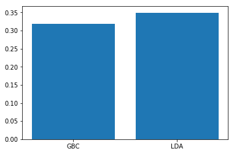
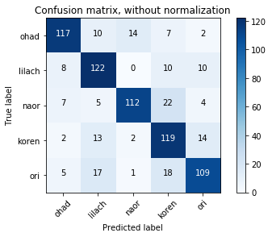

# Final Project

## PART 1


```python
import pandas as pd
import numpy as np
dfPath = "input files/messages.csv"

df = pd.read_csv(dfPath)
df = df.reset_index(drop=True)
df['sender'] = df['sender'].astype(str)
df['message'] = df['message'].astype(str)
```

### Preprocessing:
Import our 5 whatsapp personal messages, and translate them from hebrew to english messages.
Collapse last 400 messages from each file to single file calls 'messages'.
Before the translation we delete all the characters that not match to the above:
- english alphabet
- hebrew alphabet
- spaces


```python
'''
messageLimit = 400
files = ["PersonalMessages/OHAD.csv" , "PersonalMessages/ORI.csv"
         ,"PersonalMessages/LILACH.csv"
         ,"PersonalMessages/KOREN.csv"
         ,"PersonalMessages/NAOR.csv"]
'''
```


    '\nmessageLimit = 400\nfiles = ["PersonalMessages/OHAD.csv" , "PersonalMessages/ORI.csv"\n         ,"PersonalMessages/LILACH.csv"\n         ,"PersonalMessages/KOREN.csv"\n         ,"PersonalMessages/NAOR.csv"]\n'


```python
'''
from googletrans import Translator
import re
translator = Translator()
for index, file in enumerate(files):
    df = pd.read_csv(file).tail(messageLimit)
    x = np.array(df['message']).tolist()
    x = list(map(lambda s : re.sub("[^\sa-zA-Zא-ת]","",s) , x))
    df['message'] = list(map(lambda t : t.text , translator.translate(x , src='hebrew' , dest='english')))
    header = index == 0
    df.to_csv(dfPath , mode = 'a' , header = header)
'''

```


    '\nfrom googletrans import Translator\nimport re\ntranslator = Translator()\nfor index, file in enumerate(files):\n    df = pd.read_csv(file).tail(messageLimit)\n    x = np.array(df[\'message\']).tolist()\n    x = list(map(lambda s : re.sub("[^\\sa-zA-Zא-ת]","",s) , x))\n    df[\'message\'] = list(map(lambda t : t.text , translator.translate(x , src=\'hebrew\' , dest=\'english\')))\n    header = index == 0\n    df.to_csv(dfPath , mode = \'a\' , header = header)\n'


We create a function for stemming and clean stop words


```python
import re
from nltk.corpus import stopwords
import nltk
nltk.download('stopwords')
import nltk

porter = nltk.PorterStemmer()
lancaster = nltk.LancasterStemmer()

def stem_sentence(sentence):
    return " ".join([lancaster.stem(w) for w in sentence.split(" ")])

def messageToWords(message):
    letters_only = re.sub("[^a-zA-Z]", " ", message) 
    # split into individual words
    
    words = letters_only.split()                             
    #
    # In Python, searching a set is much faster than searching
    #   a list, so convert the stop words to a set
    stops = set(stopwords.words("english"))                  
    # 
    #  Remove stop words
    meaningful_words = [w for w in words if not w in stops]   
    #
    # Join the words back into one string separated by space, 
    # and return the result.
    return( " ".join( meaningful_words )) 
```

    [nltk_data] Downloading package stopwords to
    [nltk_data]     C:\Users\user\AppData\Roaming\nltk_data...
    [nltk_data]   Package stopwords is already up-to-date!
    


```python
# Get the number of messages based on the dataframe column size
numMessages = df["message"].size
# Initialize an empty list to hold the clean messages
clean_messages = []
# Loop over each review; create an index i that goes from 0 to the length
# of the movie review list 
for i in range( 0, numMessages ):
    # Call our function for each one, and add the result to the list of
    # clean messages
    clean_messages.append( stem_sentence(messageToWords( df["message"][i] ) ))
clean_messages = [mess for mess in clean_messages if mess != '']

```

## PART 2


Create the bag-of-words function, that use the CountVectorizer function, We choose max_features to 1000 for the high frequency words, the number is not to big because we dont want to detract the results. We set the stopwords parameter to english to support english stopwords.


```python
from sklearn.feature_extraction.text import CountVectorizer
def create_bag_of_words(messages):
    vectorizer = CountVectorizer(analyzer = "word",   
                                 tokenizer = None,    
                                 preprocessor = None, 
                                 stop_words = stopwords.words("english"),   
                                 max_features = 1000) 
    
    # fit_transform() Convert a collection of text documents to a matrix of token counts.
    # This implementation produces a sparse representation.
    # The input to fit_transform should be a list of strings.
    train_data_features = vectorizer.fit_transform(messages)
    
    # Numpy arrays are easy to work with, so convert the result to an 
    # array
    return train_data_features.toarray()

train_data_features = create_bag_of_words(clean_messages)
```

We divide the input into test & train sets


```python
#split to train & test
msk = np.random.rand(len(clean_messages)) < 0.8
train_x = train_data_features[msk]
test_x = train_data_features[~msk]
train_y = df.loc[msk,"sender"]
test_y = df.loc[~msk,"sender"]

```

Now we will check some classification algorithms that we learn, and compare them.

### Gradient boosting classifier
Gradient boosting is a machine learning technique for regression and classification problems, which produces a prediction model in the form of an ensemble of weak prediction models, typically decision trees. It builds the model in a stage-wise fashion like other boosting methods do, and it generalizes them by allowing optimization of an arbitrary differentiable loss function.


```python
from sklearn.ensemble import GradientBoostingClassifier

gbc_alg = GradientBoostingClassifier(random_state=10) 

gbc = gbc_alg.fit(train_x, train_y)

gbc_score = gbc.score(test_x, test_y)

gbc_score
```


    0.31909547738693467


### Linear Discriminant Analysis
Linear discriminant analysis (LDA) is a generalization of Fisher's linear discriminant, a method used in statistics, pattern recognition and machine learning to find a linear combination of features that characterizes or separates two or more classes of objects or events. The resulting combination may be used as a linear classifier, or, more commonly, for dimensionality reduction before later classification.


```python
from sklearn.discriminant_analysis import LinearDiscriminantAnalysis

lda = LinearDiscriminantAnalysis()

lda.fit(train_x, train_y)

lda_score = lda.score(test_x,test_y)

lda_score
```

    C:\Users\user\PycharmProjects\project\venv\lib\site-packages\sklearn\discriminant_analysis.py:388: UserWarning:
    
    Variables are collinear.
    
    


    0.3492462311557789


Compare the various algorithms with diagram


```python
import matplotlib.pyplot as plt
import plotly.plotly as py
%matplotlib inline
dictionary = plt.figure()

D = {u'GBC':gbc_score,  u'LDA':lda_score}

plt.bar(range(len(D)), D.values(), align='center')
plt.xticks(range(len(D)), D.keys())

plt.show()
```





We can see the LDA algorithm has the highest results.

## PART 3


```python
from keras import backend as K
K.set_image_dim_ordering('th')
```

We take all the messages of each person and make them a single sequnce that every message seprated by delimiter 'DELIMITER', the purpose of the delimiter is to know when stop create new message


```python
MESSAGE_DELIMITER = ' DELIMITER '
ohadName = 'ohad'
lilachName = 'lilach'
naorName = 'naor'
korenName = 'koren'
oriName = 'ori'
ohad_messages = df.loc[df['sender'] == ohadName]['message']
lilach_messages = df.loc[df['sender'] == lilachName]['message']
naor_messages = df.loc[df['sender'] == naorName]['message']
koren_messages = df.loc[df['sender'] == korenName]['message']
ori_messages = df.loc[df['sender'] == oriName]['message']

def get_messages_joined(messages):
    return MESSAGE_DELIMITER.join(messages)
    
ohad_messages = get_messages_joined(ohad_messages)
lilach_messages = get_messages_joined(lilach_messages)
naor_messages = get_messages_joined(naor_messages)
koren_messages = get_messages_joined(koren_messages)
ori_messages = get_messages_joined(ori_messages)
```

Most words in our messages will only appear one or two times. so we remove these infrequent words. Having a huge vocabulary will make our model slow to train, and because we don’t have a lot of contextual examples for such words we wouldn’t be able to learn how to use them correctly anyway.To really understand how to appropriately use a word you need to have seen it in different contexts. In our code we limit our vocabulary to the vocabulary_size most common words (which was set to 600, mainly for memory limitations).

- We replace all words not included in our vocabulary by UNKNOWN_TOKEN.
- We also want to learn which words tend start and end a sentence. To do this we prepend a special SENTENCE_START token, and append a special SENTENCE_END token to each sentence.


```python
vocabulary_size = 600
unknown_token = "UNKNOWNTOKEN"
sentence_start_token = "SENTENCESTART"
sentence_end_token = "SENTENCEEND"
line_break= "NEWLINE"
separator= "SEPARATOR"
```

Create a function that convert these special characters into the mentioned tokens:


```python

def replace_specific_symbols_and_clean(message):
    message = message.replace('...', '.')
    message = message.replace('....', '.')
    message = message.replace('\n',' '+ line_break + ' ')
    message = message.replace('--',' '+ separator + ' ')
    message = message.replace('.',' '+sentence_end_token +' '+ sentence_start_token+' ' )
    return messageToWords(message)
```

Convert these special characters for each person messages


```python
ohad_messages_cleaned = replace_specific_symbols_and_clean(ohad_messages)
lilach_messages_cleaned = replace_specific_symbols_and_clean(lilach_messages)
naor_messages_cleaned = replace_specific_symbols_and_clean(naor_messages)
koren_messages_cleaned = replace_specific_symbols_and_clean(koren_messages)
ori_messages_cleaned = replace_specific_symbols_and_clean(ori_messages)

```

We split the messages to list of words in the original order.
The main paramterts are 'lower' (lower case) that not neccesary to us so we choose false, and 'split' is space between words


```python
from keras.preprocessing.text import text_to_word_sequence
ohad_messages_splitted = text_to_word_sequence(ohad_messages_cleaned, lower=False, split=" ")
lilach_messages_splitted = text_to_word_sequence(lilach_messages_cleaned, lower=False, split=" ")
naor_messages_splitted = text_to_word_sequence(naor_messages_cleaned, lower=False, split=" ")
koren_messages_splitted = text_to_word_sequence(koren_messages_cleaned, lower=False, split=" ")
ori_messages_splitted = text_to_word_sequence(ori_messages_cleaned, lower=False, split=" ")

```

The input to our Recurrent Neural Networks are vectors, not strings. So we create a mapping between words and indices.

Tokenizer is a class for vectorizing texts, or/and turning texts into sequences.
 It considers the vocabulary size (nb_words) for indexing most frequent words, otherwise using the unknown-token index.


```python
from keras.preprocessing.text import Tokenizer
ohad_tokenizer = Tokenizer(num_words=150,char_level=False)
ohad_tokenizer.fit_on_texts(ohad_messages_splitted)

lilach_tokenizer = Tokenizer(num_words=150,char_level=False)
lilach_tokenizer.fit_on_texts(lilach_messages_splitted)

naor_tokenizer = Tokenizer(num_words=150,char_level=False)
naor_tokenizer.fit_on_texts(naor_messages_splitted)

koren_tokenizer = Tokenizer(num_words=150,char_level=False)
koren_tokenizer.fit_on_texts(koren_messages_splitted)

ori_tokenizer = Tokenizer(num_words=150,char_level=False)
ori_tokenizer.fit_on_texts(ori_messages_splitted)
```

We represent each word as a one-hot vector of size vocabulary_size. So, each word will become a vector, and the input will be a matrix, with each row representing a word.

texts_to_matrix performs this conversion for us when setting the mode parameter to 'binary'.


```python
ohad_text_mtx = ohad_tokenizer.texts_to_matrix(ohad_messages_splitted, mode='binary')

lilach_text_mtx = lilach_tokenizer.texts_to_matrix(lilach_messages_splitted, mode='binary')

naor_text_mtx = naor_tokenizer.texts_to_matrix(naor_messages_splitted, mode='binary')

koren_text_mtx = koren_tokenizer.texts_to_matrix(koren_messages_splitted, mode='binary')

ori_text_mtx = ori_tokenizer.texts_to_matrix(ori_messages_splitted, mode='binary')
```

our goal is to predict the next word, but we learn the model by the three last words


```python
ohad_input = ohad_text_mtx[:-3]
ohad_output = ohad_text_mtx[3:]

lilach_input = lilach_text_mtx[:-3]
lilach_output = lilach_text_mtx[3:]

naor_input = naor_text_mtx[:-3]
naor_output = naor_text_mtx[3:]

koren_input = koren_text_mtx[:-3]
koren_output = koren_text_mtx[3:]

ori_input = ori_text_mtx[:-3]
ori_output = ori_text_mtx[3:]
```

### Recurrent Neural Network
We use simple recurrent neural network for adding a full connected Recurrent neural network.
We create vocabulary for each person and removes duplicates.


```python
import pandas as pd
import numpy as np

ohad_vocab = pd.DataFrame({'word':ohad_messages_splitted,'code':np.argmax(ohad_text_mtx,axis=1)})
ohad_vocab = ohad_vocab.drop_duplicates()

lilach_vocab = pd.DataFrame({'word':lilach_messages_splitted,'code':np.argmax(lilach_text_mtx,axis=1)})
lilach_vocab = lilach_vocab.drop_duplicates()

naor_vocab = pd.DataFrame({'word':naor_messages_splitted,'code':np.argmax(naor_text_mtx,axis=1)})
naor_vocab = naor_vocab.drop_duplicates()

koren_vocab = pd.DataFrame({'word':koren_messages_splitted,'code':np.argmax(koren_text_mtx,axis=1)})
koren_vocab = koren_vocab.drop_duplicates()

ori_vocab = pd.DataFrame({'word':ori_messages_splitted,'code':np.argmax(ori_text_mtx,axis=1)})
ori_vocab = ori_vocab.drop_duplicates()
```

Importing keras libraries.


```python
from keras.models import Sequential
from keras.layers.core import Dense, Flatten
from keras.layers.embeddings import Embedding
```

Create a sequential model for each person in order to create new messages


```python
ohad_model = Sequential()

lilach_model = Sequential()

naor_model = Sequential()

koren_model = Sequential()

ori_model = Sequential()
```

First we adding embedding layer.
- we set the input to each person messages matrix
- we set the dimension to the number of rows in the matrix.


```python
ohad_model.add(Embedding(input_dim=ohad_input.shape[1],output_dim= 42, input_length=ohad_input.shape[1]))

lilach_model.add(Embedding(input_dim=lilach_input.shape[1],output_dim= 42, input_length=lilach_input.shape[1]))

naor_model.add(Embedding(input_dim=naor_input.shape[1],output_dim= 42, input_length=naor_input.shape[1]))

koren_model.add(Embedding(input_dim=koren_input.shape[1],output_dim= 42, input_length=koren_input.shape[1]))

ori_model.add(Embedding(input_dim=ori_input.shape[1],output_dim= 42, input_length=ori_input.shape[1]))
```

For each person, we connect the dense output layer , by adding RNN layer with 256 hidden nodes and then passing it to the output layer.


```python
from keras.layers.recurrent import SimpleRNN
n_hidden = 256

ohad_model.add(SimpleRNN(n_hidden , activation='relu' ,  recurrent_initializer = 'identity'))
ohad_model.add(Dense(ohad_output.shape[1], activation='sigmoid'))

lilach_model.add(SimpleRNN(n_hidden , activation='relu' ,  recurrent_initializer = 'identity'))
lilach_model.add(Dense(lilach_output.shape[1], activation='sigmoid'))

naor_model.add(SimpleRNN(n_hidden , activation='relu' ,  recurrent_initializer = 'identity'))
naor_model.add(Dense(naor_output.shape[1], activation='sigmoid'))

koren_model.add(SimpleRNN(n_hidden , activation='relu' ,  recurrent_initializer = 'identity'))
koren_model.add(Dense(koren_output.shape[1], activation='sigmoid'))

ori_model.add(SimpleRNN(n_hidden , activation='relu' ,  recurrent_initializer = 'identity'))
ori_model.add(Dense(ori_output.shape[1], activation='sigmoid'))
```

We plot a summay for each person , to learn things aboud each person model


```python
ohad_model.summary(line_length=100)

lilach_model.summary(line_length=100)

naor_model.summary(line_length=100)

koren_model.summary(line_length=100)

ori_model.summary(line_length=100)
```

    ____________________________________________________________________________________________________
    Layer (type)                                 Output Shape                            Param #        
    ====================================================================================================
    embedding_46 (Embedding)                     (None, 150, 42)                         6300           
    ____________________________________________________________________________________________________
    simple_rnn_32 (SimpleRNN)                    (None, 256)                             76544          
    ____________________________________________________________________________________________________
    dense_36 (Dense)                             (None, 150)                             38550          
    ====================================================================================================
    Total params: 121,394
    Trainable params: 121,394
    Non-trainable params: 0
    ____________________________________________________________________________________________________
    ____________________________________________________________________________________________________
    Layer (type)                                 Output Shape                            Param #        
    ====================================================================================================
    embedding_47 (Embedding)                     (None, 150, 42)                         6300           
    ____________________________________________________________________________________________________
    simple_rnn_33 (SimpleRNN)                    (None, 256)                             76544          
    ____________________________________________________________________________________________________
    dense_37 (Dense)                             (None, 150)                             38550          
    ====================================================================================================
    Total params: 121,394
    Trainable params: 121,394
    Non-trainable params: 0
    ____________________________________________________________________________________________________
    ____________________________________________________________________________________________________
    Layer (type)                                 Output Shape                            Param #        
    ====================================================================================================
    embedding_48 (Embedding)                     (None, 150, 42)                         6300           
    ____________________________________________________________________________________________________
    simple_rnn_34 (SimpleRNN)                    (None, 256)                             76544          
    ____________________________________________________________________________________________________
    dense_38 (Dense)                             (None, 150)                             38550          
    ====================================================================================================
    Total params: 121,394
    Trainable params: 121,394
    Non-trainable params: 0
    ____________________________________________________________________________________________________
    ____________________________________________________________________________________________________
    Layer (type)                                 Output Shape                            Param #        
    ====================================================================================================
    embedding_49 (Embedding)                     (None, 150, 42)                         6300           
    ____________________________________________________________________________________________________
    simple_rnn_35 (SimpleRNN)                    (None, 256)                             76544          
    ____________________________________________________________________________________________________
    dense_39 (Dense)                             (None, 150)                             38550          
    ====================================================================================================
    Total params: 121,394
    Trainable params: 121,394
    Non-trainable params: 0
    ____________________________________________________________________________________________________
    ____________________________________________________________________________________________________
    Layer (type)                                 Output Shape                            Param #        
    ====================================================================================================
    embedding_50 (Embedding)                     (None, 150, 42)                         6300           
    ____________________________________________________________________________________________________
    simple_rnn_36 (SimpleRNN)                    (None, 256)                             76544          
    ____________________________________________________________________________________________________
    dense_40 (Dense)                             (None, 150)                             38550          
    ====================================================================================================
    Total params: 121,394
    Trainable params: 121,394
    Non-trainable params: 0
    ____________________________________________________________________________________________________
    

Compile the person models from training, and we declare the loss function and the optimizer.
Because this is a multi-class classification problem, we can use the log loss function (called “categorical_crossentropy” in Keras), and optimize the network using the rmsprop optimization optimizer, which is is usually a good choice for recurrent neural networks.


```python
ohad_model.compile(loss='categorical_crossentropy', optimizer='rmsprop',metrics=["accuracy"])

lilach_model.compile(loss='categorical_crossentropy', optimizer='rmsprop',metrics=["accuracy"])

naor_model.compile(loss='categorical_crossentropy', optimizer='rmsprop',metrics=["accuracy"])

koren_model.compile(loss='categorical_crossentropy', optimizer='rmsprop',metrics=["accuracy"])

ori_model.compile(loss='categorical_crossentropy', optimizer='rmsprop',metrics=["accuracy"])
```

To fit the model, all we have to do is declare the batch size and number of epochs to train for, then pass in our training data.

We choose 30 iterations in each model to avoid overfitting and time.


```python
ohad_model.fit(ohad_input, y=ohad_output, batch_size=200, epochs=30, verbose=1, validation_split=0.2)

lilach_model.fit(lilach_input, y=lilach_output, batch_size=200, epochs=30, verbose=1, validation_split=0.2)

naor_model.fit(naor_input, y=naor_output, batch_size=200, epochs=30, verbose=1, validation_split=0.2)

koren_model.fit(koren_input, y=koren_output, batch_size=200, epochs=30, verbose=1, validation_split=0.2)

ori_model.fit(ori_input, y=ori_output, batch_size=200, epochs=30, verbose=1, validation_split=0.2)
```

    Train on 1100 samples, validate on 276 samples
    Epoch 1/30
    1100/1100 [==============================] - 10s 9ms/step - loss: 5.3698 - acc: 0.2300 - val_loss: 5.4327 - val_acc: 0.3188
    Epoch 2/30
    1100/1100 [==============================] - 5s 5ms/step - loss: 5.5616 - acc: 0.2718 - val_loss: 5.4327 - val_acc: 0.3188
    Epoch 3/30
    1100/1100 [==============================] - 5s 4ms/step - loss: 5.5616 - acc: 0.2718 - val_loss: 5.4327 - val_acc: 0.3188
    Epoch 4/30
    1100/1100 [==============================] - 4s 4ms/step - loss: 5.5616 - acc: 0.2718 - val_loss: 5.4327 - val_acc: 0.3188
    Epoch 5/30
    1100/1100 [==============================] - 4s 4ms/step - loss: 5.5616 - acc: 0.2718 - val_loss: 5.4327 - val_acc: 0.3188
    Epoch 6/30
    1100/1100 [==============================] - 4s 4ms/step - loss: 5.5616 - acc: 0.2718 - val_loss: 5.4327 - val_acc: 0.3188
    Epoch 7/30
    1100/1100 [==============================] - 4s 4ms/step - loss: 5.5616 - acc: 0.2718 - val_loss: 5.4327 - val_acc: 0.3188
    Epoch 8/30
    1100/1100 [==============================] - 4s 4ms/step - loss: 5.5616 - acc: 0.2718 - val_loss: 5.4327 - val_acc: 0.3188
    Epoch 9/30
    1100/1100 [==============================] - 4s 4ms/step - loss: 5.5616 - acc: 0.2718 - val_loss: 5.4327 - val_acc: 0.3188
    Epoch 10/30
    1100/1100 [==============================] - 4s 4ms/step - loss: 5.5616 - acc: 0.2718 - val_loss: 5.4327 - val_acc: 0.3188
    Epoch 11/30
    1100/1100 [==============================] - 4s 4ms/step - loss: 5.5616 - acc: 0.2718 - val_loss: 5.4327 - val_acc: 0.3188
    Epoch 12/30
    1100/1100 [==============================] - 4s 4ms/step - loss: 5.5616 - acc: 0.2718 - val_loss: 5.4327 - val_acc: 0.3188
    Epoch 13/30
    1100/1100 [==============================] - 4s 4ms/step - loss: 5.5616 - acc: 0.2718 - val_loss: 5.4327 - val_acc: 0.3188
    Epoch 14/30
    1100/1100 [==============================] - 4s 4ms/step - loss: 5.5616 - acc: 0.2718 - val_loss: 5.4327 - val_acc: 0.3188
    Epoch 15/30
    1100/1100 [==============================] - 4s 4ms/step - loss: 5.5616 - acc: 0.2718 - val_loss: 5.4327 - val_acc: 0.3188
    Epoch 16/30
    1100/1100 [==============================] - 4s 4ms/step - loss: 5.5616 - acc: 0.2718 - val_loss: 5.4327 - val_acc: 0.3188
    Epoch 17/30
    1100/1100 [==============================] - 4s 4ms/step - loss: 5.5616 - acc: 0.2718 - val_loss: 5.4327 - val_acc: 0.3188
    Epoch 18/30
    1100/1100 [==============================] - 4s 4ms/step - loss: 5.5616 - acc: 0.2718 - val_loss: 5.4327 - val_acc: 0.3188
    Epoch 19/30
    1100/1100 [==============================] - 4s 4ms/step - loss: 5.5616 - acc: 0.2718 - val_loss: 5.4327 - val_acc: 0.3188
    Epoch 20/30
    1100/1100 [==============================] - 4s 4ms/step - loss: 5.5616 - acc: 0.2718 - val_loss: 5.4327 - val_acc: 0.3188
    Epoch 21/30
    1100/1100 [==============================] - 4s 4ms/step - loss: 5.5616 - acc: 0.2718 - val_loss: 5.4327 - val_acc: 0.3188
    Epoch 22/30
    1100/1100 [==============================] - 4s 3ms/step - loss: 5.5616 - acc: 0.2718 - val_loss: 5.4327 - val_acc: 0.3188
    Epoch 23/30
    1100/1100 [==============================] - 4s 4ms/step - loss: 5.5616 - acc: 0.2718 - val_loss: 5.4327 - val_acc: 0.3188
    Epoch 24/30
    1100/1100 [==============================] - 4s 3ms/step - loss: 5.5616 - acc: 0.2718 - val_loss: 5.4327 - val_acc: 0.3188
    Epoch 25/30
    1100/1100 [==============================] - 4s 3ms/step - loss: 5.5616 - acc: 0.2718 - val_loss: 5.4327 - val_acc: 0.3188
    Epoch 26/30
    1100/1100 [==============================] - 4s 3ms/step - loss: 5.5616 - acc: 0.2718 - val_loss: 5.4327 - val_acc: 0.3188
    Epoch 27/30
    1100/1100 [==============================] - 4s 4ms/step - loss: 5.5616 - acc: 0.2718 - val_loss: 5.4327 - val_acc: 0.3188
    Epoch 28/30
    1100/1100 [==============================] - 4s 4ms/step - loss: 5.5616 - acc: 0.2718 - val_loss: 5.4327 - val_acc: 0.3188
    Epoch 29/30
    1100/1100 [==============================] - 4s 3ms/step - loss: 5.5616 - acc: 0.2718 - val_loss: 5.4327 - val_acc: 0.3188
    Epoch 30/30
    1100/1100 [==============================] - 4s 3ms/step - loss: 5.5616 - acc: 0.2718 - val_loss: 5.4327 - val_acc: 0.3188
    Train on 1296 samples, validate on 324 samples
    Epoch 1/30
    1296/1296 [==============================] - 7s 5ms/step - loss: 6.3871 - acc: 0.2269 - val_loss: 6.7985 - val_acc: 0.2006
    Epoch 2/30
    1296/1296 [==============================] - 4s 3ms/step - loss: 6.7453 - acc: 0.2569 - val_loss: 6.7985 - val_acc: 0.2006
    Epoch 3/30
    1296/1296 [==============================] - 4s 3ms/step - loss: 6.7453 - acc: 0.2569 - val_loss: 6.7985 - val_acc: 0.2006
    Epoch 4/30
    1296/1296 [==============================] - 4s 3ms/step - loss: 6.7453 - acc: 0.2569 - val_loss: 6.7985 - val_acc: 0.2006
    Epoch 5/30
    1296/1296 [==============================] - 4s 3ms/step - loss: 6.7453 - acc: 0.2569 - val_loss: 6.7985 - val_acc: 0.2006
    Epoch 6/30
    1296/1296 [==============================] - 4s 3ms/step - loss: 6.7453 - acc: 0.2569 - val_loss: 6.7985 - val_acc: 0.2006
    Epoch 7/30
    1296/1296 [==============================] - 4s 3ms/step - loss: 6.7453 - acc: 0.2569 - val_loss: 6.7985 - val_acc: 0.2006
    Epoch 8/30
    1296/1296 [==============================] - 4s 3ms/step - loss: 6.7453 - acc: 0.2569 - val_loss: 6.7985 - val_acc: 0.2006
    Epoch 9/30
    1296/1296 [==============================] - 4s 3ms/step - loss: 6.7453 - acc: 0.2569 - val_loss: 6.7985 - val_acc: 0.2006
    Epoch 10/30
    1296/1296 [==============================] - 4s 3ms/step - loss: 6.7453 - acc: 0.2569 - val_loss: 6.7985 - val_acc: 0.2006
    Epoch 11/30
    1296/1296 [==============================] - 4s 3ms/step - loss: 6.7453 - acc: 0.2569 - val_loss: 6.7985 - val_acc: 0.2006
    Epoch 12/30
    1296/1296 [==============================] - 4s 3ms/step - loss: 6.7453 - acc: 0.2569 - val_loss: 6.7985 - val_acc: 0.2006
    Epoch 13/30
    1296/1296 [==============================] - 4s 3ms/step - loss: 6.7453 - acc: 0.2569 - val_loss: 6.7985 - val_acc: 0.2006
    Epoch 14/30
    1296/1296 [==============================] - 4s 3ms/step - loss: 6.7453 - acc: 0.2569 - val_loss: 6.7985 - val_acc: 0.2006
    Epoch 15/30
    1296/1296 [==============================] - 4s 3ms/step - loss: 6.7453 - acc: 0.2569 - val_loss: 6.7985 - val_acc: 0.2006
    Epoch 16/30
    1296/1296 [==============================] - 4s 3ms/step - loss: 6.7453 - acc: 0.2569 - val_loss: 6.7985 - val_acc: 0.2006
    Epoch 17/30
    1296/1296 [==============================] - 4s 3ms/step - loss: 6.7453 - acc: 0.2569 - val_loss: 6.7985 - val_acc: 0.2006
    Epoch 18/30
    1296/1296 [==============================] - 4s 3ms/step - loss: 6.7453 - acc: 0.2569 - val_loss: 6.7985 - val_acc: 0.2006
    Epoch 19/30
    1296/1296 [==============================] - 4s 3ms/step - loss: 6.7453 - acc: 0.2569 - val_loss: 6.7985 - val_acc: 0.2006
    Epoch 20/30
    1296/1296 [==============================] - 4s 3ms/step - loss: 6.7453 - acc: 0.2569 - val_loss: 6.7985 - val_acc: 0.2006
    Epoch 21/30
    1296/1296 [==============================] - 4s 3ms/step - loss: 6.7453 - acc: 0.2569 - val_loss: 6.7985 - val_acc: 0.2006
    Epoch 22/30
    1296/1296 [==============================] - 4s 3ms/step - loss: 6.7453 - acc: 0.2569 - val_loss: 6.7985 - val_acc: 0.2006
    Epoch 23/30
    1296/1296 [==============================] - 4s 3ms/step - loss: 6.7453 - acc: 0.2569 - val_loss: 6.7985 - val_acc: 0.2006
    Epoch 24/30
    1296/1296 [==============================] - 4s 3ms/step - loss: 6.7453 - acc: 0.2569 - val_loss: 6.7985 - val_acc: 0.2006
    Epoch 25/30
    1296/1296 [==============================] - 4s 3ms/step - loss: 6.7453 - acc: 0.2569 - val_loss: 6.7985 - val_acc: 0.2006
    Epoch 26/30
    1296/1296 [==============================] - 4s 3ms/step - loss: 6.7453 - acc: 0.2569 - val_loss: 6.7985 - val_acc: 0.2006
    Epoch 27/30
    1296/1296 [==============================] - 4s 3ms/step - loss: 6.7453 - acc: 0.2569 - val_loss: 6.7985 - val_acc: 0.2006
    Epoch 28/30
    1296/1296 [==============================] - 4s 3ms/step - loss: 6.7453 - acc: 0.2569 - val_loss: 6.7985 - val_acc: 0.2006
    Epoch 29/30
    1296/1296 [==============================] - 4s 3ms/step - loss: 6.7453 - acc: 0.2569 - val_loss: 6.7985 - val_acc: 0.2006
    Epoch 30/30
    1296/1296 [==============================] - 4s 3ms/step - loss: 6.7453 - acc: 0.2569 - val_loss: 6.7985 - val_acc: 0.2006
    Train on 1005 samples, validate on 252 samples
    Epoch 1/30
    1005/1005 [==============================] - 6s 6ms/step - loss: 5.5323 - acc: 0.2657 - val_loss: 6.2469 - val_acc: 0.2857
    Epoch 2/30
    1005/1005 [==============================] - 3s 3ms/step - loss: 5.8073 - acc: 0.3244 - val_loss: 6.2469 - val_acc: 0.2857
    Epoch 3/30
    1005/1005 [==============================] - 3s 3ms/step - loss: 5.8073 - acc: 0.3244 - val_loss: 6.2469 - val_acc: 0.2857
    Epoch 4/30
    1005/1005 [==============================] - 3s 3ms/step - loss: 5.8073 - acc: 0.3244 - val_loss: 6.2469 - val_acc: 0.2857
    Epoch 5/30
    1005/1005 [==============================] - 3s 3ms/step - loss: 5.8073 - acc: 0.3244 - val_loss: 6.2469 - val_acc: 0.2857
    Epoch 6/30
    1005/1005 [==============================] - 3s 3ms/step - loss: 5.8073 - acc: 0.3244 - val_loss: 6.2469 - val_acc: 0.2857
    Epoch 7/30
    1005/1005 [==============================] - 3s 3ms/step - loss: 5.8073 - acc: 0.3244 - val_loss: 6.2469 - val_acc: 0.2857
    Epoch 8/30
    1005/1005 [==============================] - 3s 3ms/step - loss: 5.8073 - acc: 0.3244 - val_loss: 6.2469 - val_acc: 0.2857
    Epoch 9/30
    1005/1005 [==============================] - 4s 3ms/step - loss: 5.8073 - acc: 0.3244 - val_loss: 6.2469 - val_acc: 0.2857
    Epoch 10/30
    1005/1005 [==============================] - 3s 3ms/step - loss: 5.8073 - acc: 0.3244 - val_loss: 6.2469 - val_acc: 0.2857
    Epoch 11/30
    1005/1005 [==============================] - 4s 3ms/step - loss: 5.8073 - acc: 0.3244 - val_loss: 6.2469 - val_acc: 0.2857
    Epoch 12/30
    1005/1005 [==============================] - 3s 3ms/step - loss: 5.8073 - acc: 0.3244 - val_loss: 6.2469 - val_acc: 0.2857
    Epoch 13/30
    1005/1005 [==============================] - 3s 3ms/step - loss: 5.8073 - acc: 0.3244 - val_loss: 6.2469 - val_acc: 0.2857
    Epoch 14/30
    1005/1005 [==============================] - 3s 3ms/step - loss: 5.8073 - acc: 0.3244 - val_loss: 6.2469 - val_acc: 0.2857
    Epoch 15/30
    1005/1005 [==============================] - 3s 3ms/step - loss: 5.8073 - acc: 0.3244 - val_loss: 6.2469 - val_acc: 0.2857
    Epoch 16/30
    1005/1005 [==============================] - 3s 3ms/step - loss: 5.8073 - acc: 0.3244 - val_loss: 6.2469 - val_acc: 0.2857
    Epoch 17/30
    1005/1005 [==============================] - 3s 3ms/step - loss: 5.8073 - acc: 0.3244 - val_loss: 6.2469 - val_acc: 0.2857
    Epoch 18/30
    1005/1005 [==============================] - 3s 3ms/step - loss: 5.8073 - acc: 0.3244 - val_loss: 6.2469 - val_acc: 0.2857
    Epoch 19/30
    1005/1005 [==============================] - 4s 4ms/step - loss: 5.8073 - acc: 0.3244 - val_loss: 6.2469 - val_acc: 0.2857
    Epoch 20/30
    1005/1005 [==============================] - 4s 4ms/step - loss: 5.8073 - acc: 0.3244 - val_loss: 6.2469 - val_acc: 0.2857
    Epoch 21/30
    1005/1005 [==============================] - 4s 4ms/step - loss: 5.8073 - acc: 0.3244 - val_loss: 6.2469 - val_acc: 0.2857
    Epoch 22/30
    1005/1005 [==============================] - 4s 4ms/step - loss: 5.8073 - acc: 0.3244 - val_loss: 6.2469 - val_acc: 0.2857
    Epoch 23/30
    1005/1005 [==============================] - 4s 4ms/step - loss: 5.8073 - acc: 0.3244 - val_loss: 6.2469 - val_acc: 0.2857
    Epoch 24/30
    1005/1005 [==============================] - 4s 4ms/step - loss: 5.8073 - acc: 0.3244 - val_loss: 6.2469 - val_acc: 0.2857
    Epoch 25/30
    1005/1005 [==============================] - 4s 4ms/step - loss: 5.8073 - acc: 0.3244 - val_loss: 6.2469 - val_acc: 0.2857
    Epoch 26/30
    1005/1005 [==============================] - 4s 4ms/step - loss: 5.8073 - acc: 0.3244 - val_loss: 6.2469 - val_acc: 0.2857
    Epoch 27/30
    1005/1005 [==============================] - 3s 3ms/step - loss: 5.8073 - acc: 0.3244 - val_loss: 6.2469 - val_acc: 0.2857
    Epoch 28/30
    1005/1005 [==============================] - 3s 3ms/step - loss: 5.8073 - acc: 0.3244 - val_loss: 6.2469 - val_acc: 0.2857
    Epoch 29/30
    1005/1005 [==============================] - 3s 3ms/step - loss: 5.8073 - acc: 0.3244 - val_loss: 6.2469 - val_acc: 0.2857
    Epoch 30/30
    1005/1005 [==============================] - 4s 4ms/step - loss: 5.8073 - acc: 0.3244 - val_loss: 6.2469 - val_acc: 0.2857
    Train on 1084 samples, validate on 272 samples
    Epoch 1/30
    1084/1084 [==============================] - 7s 6ms/step - loss: 5.1481 - acc: 0.2343 - val_loss: 5.0627 - val_acc: 0.2941
    Epoch 2/30
    1084/1084 [==============================] - 4s 4ms/step - loss: 5.4298 - acc: 0.2943 - val_loss: 5.0627 - val_acc: 0.2941
    Epoch 3/30
    1084/1084 [==============================] - 4s 4ms/step - loss: 5.4298 - acc: 0.2943 - val_loss: 5.0627 - val_acc: 0.2941
    Epoch 4/30
    1084/1084 [==============================] - 4s 4ms/step - loss: 5.4298 - acc: 0.2943 - val_loss: 5.0627 - val_acc: 0.2941
    Epoch 5/30
    1084/1084 [==============================] - 4s 3ms/step - loss: 5.4298 - acc: 0.2943 - val_loss: 5.0627 - val_acc: 0.2941
    Epoch 6/30
    1084/1084 [==============================] - 4s 4ms/step - loss: 5.4298 - acc: 0.2943 - val_loss: 5.0627 - val_acc: 0.2941
    Epoch 7/30
    1084/1084 [==============================] - 4s 4ms/step - loss: 5.4298 - acc: 0.2943 - val_loss: 5.0627 - val_acc: 0.2941
    Epoch 8/30
    1084/1084 [==============================] - 4s 4ms/step - loss: 5.4298 - acc: 0.2943 - val_loss: 5.0627 - val_acc: 0.2941
    Epoch 9/30
    1084/1084 [==============================] - 4s 4ms/step - loss: 5.4298 - acc: 0.2943 - val_loss: 5.0627 - val_acc: 0.2941
    Epoch 10/30
    1084/1084 [==============================] - 4s 4ms/step - loss: 5.4298 - acc: 0.2943 - val_loss: 5.0627 - val_acc: 0.2941
    Epoch 11/30
    1084/1084 [==============================] - 4s 4ms/step - loss: 5.4298 - acc: 0.2943 - val_loss: 5.0627 - val_acc: 0.2941
    Epoch 12/30
    1084/1084 [==============================] - 4s 4ms/step - loss: 5.4298 - acc: 0.2943 - val_loss: 5.0627 - val_acc: 0.2941
    Epoch 13/30
    1084/1084 [==============================] - 4s 3ms/step - loss: 5.4298 - acc: 0.2943 - val_loss: 5.0627 - val_acc: 0.2941
    Epoch 14/30
    1084/1084 [==============================] - 4s 4ms/step - loss: 5.4298 - acc: 0.2943 - val_loss: 5.0627 - val_acc: 0.2941
    Epoch 15/30
    1084/1084 [==============================] - 4s 4ms/step - loss: 5.4298 - acc: 0.2943 - val_loss: 5.0627 - val_acc: 0.2941
    Epoch 16/30
    1084/1084 [==============================] - 4s 4ms/step - loss: 5.4298 - acc: 0.2943 - val_loss: 5.0627 - val_acc: 0.2941
    Epoch 17/30
    1084/1084 [==============================] - 4s 4ms/step - loss: 5.4298 - acc: 0.2943 - val_loss: 5.0627 - val_acc: 0.2941
    Epoch 18/30
    1084/1084 [==============================] - 4s 4ms/step - loss: 5.4298 - acc: 0.2943 - val_loss: 5.0627 - val_acc: 0.2941
    Epoch 19/30
    1084/1084 [==============================] - 4s 4ms/step - loss: 5.4298 - acc: 0.2943 - val_loss: 5.0627 - val_acc: 0.2941
    Epoch 20/30
    1084/1084 [==============================] - 4s 4ms/step - loss: 5.4298 - acc: 0.2943 - val_loss: 5.0627 - val_acc: 0.2941
    Epoch 21/30
    1084/1084 [==============================] - 4s 3ms/step - loss: 5.4298 - acc: 0.2943 - val_loss: 5.0627 - val_acc: 0.2941
    Epoch 22/30
    1084/1084 [==============================] - 4s 4ms/step - loss: 5.4298 - acc: 0.2943 - val_loss: 5.0627 - val_acc: 0.2941
    Epoch 23/30
    1084/1084 [==============================] - 4s 4ms/step - loss: 5.4298 - acc: 0.2943 - val_loss: 5.0627 - val_acc: 0.2941
    Epoch 24/30
    1084/1084 [==============================] - 4s 4ms/step - loss: 5.4298 - acc: 0.2943 - val_loss: 5.0627 - val_acc: 0.2941
    Epoch 25/30
    1084/1084 [==============================] - 4s 4ms/step - loss: 5.4298 - acc: 0.2943 - val_loss: 5.0627 - val_acc: 0.2941
    Epoch 26/30
    1084/1084 [==============================] - 4s 4ms/step - loss: 5.4298 - acc: 0.2943 - val_loss: 5.0627 - val_acc: 0.2941
    Epoch 27/30
    1084/1084 [==============================] - 4s 4ms/step - loss: 5.4298 - acc: 0.2943 - val_loss: 5.0627 - val_acc: 0.2941
    Epoch 28/30
    1084/1084 [==============================] - 4s 4ms/step - loss: 5.4298 - acc: 0.2943 - val_loss: 5.0627 - val_acc: 0.2941
    Epoch 29/30
    1084/1084 [==============================] - 4s 4ms/step - loss: 5.4298 - acc: 0.2943 - val_loss: 5.0627 - val_acc: 0.2941
    Epoch 30/30
    1084/1084 [==============================] - 4s 4ms/step - loss: 5.4298 - acc: 0.2943 - val_loss: 5.0627 - val_acc: 0.2941
    Train on 1438 samples, validate on 360 samples
    Epoch 1/30
    1438/1438 [==============================] - 9s 6ms/step - loss: 5.5668 - acc: 0.1829 - val_loss: 4.7367 - val_acc: 0.2361
    Epoch 2/30
    1438/1438 [==============================] - 6s 4ms/step - loss: 5.7042 - acc: 0.2177 - val_loss: 4.7367 - val_acc: 0.2361
    Epoch 3/30
    1438/1438 [==============================] - 6s 4ms/step - loss: 5.7042 - acc: 0.2177 - val_loss: 4.7367 - val_acc: 0.2361
    Epoch 4/30
    1438/1438 [==============================] - 6s 4ms/step - loss: 5.7042 - acc: 0.2177 - val_loss: 4.7367 - val_acc: 0.2361
    Epoch 5/30
    1438/1438 [==============================] - 6s 4ms/step - loss: 5.7042 - acc: 0.2177 - val_loss: 4.7367 - val_acc: 0.2361
    Epoch 6/30
    1438/1438 [==============================] - 6s 4ms/step - loss: 5.7042 - acc: 0.2177 - val_loss: 4.7367 - val_acc: 0.2361
    Epoch 7/30
    1438/1438 [==============================] - 6s 4ms/step - loss: 5.7042 - acc: 0.2177 - val_loss: 4.7367 - val_acc: 0.2361
    Epoch 8/30
    1438/1438 [==============================] - 6s 4ms/step - loss: 5.7042 - acc: 0.2177 - val_loss: 4.7367 - val_acc: 0.2361
    Epoch 9/30
    1438/1438 [==============================] - 6s 4ms/step - loss: 5.7042 - acc: 0.2177 - val_loss: 4.7367 - val_acc: 0.2361
    Epoch 10/30
    1438/1438 [==============================] - 7s 5ms/step - loss: 5.7042 - acc: 0.2177 - val_loss: 4.7367 - val_acc: 0.2361
    Epoch 11/30
    1438/1438 [==============================] - 7s 5ms/step - loss: 5.7042 - acc: 0.2177 - val_loss: 4.7367 - val_acc: 0.2361
    Epoch 12/30
    1438/1438 [==============================] - 6s 4ms/step - loss: 5.7042 - acc: 0.2177 - val_loss: 4.7367 - val_acc: 0.2361
    Epoch 13/30
    1438/1438 [==============================] - 6s 4ms/step - loss: 5.7042 - acc: 0.2177 - val_loss: 4.7367 - val_acc: 0.2361
    Epoch 14/30
    1438/1438 [==============================] - 6s 4ms/step - loss: 5.7042 - acc: 0.2177 - val_loss: 4.7367 - val_acc: 0.2361
    Epoch 15/30
    1438/1438 [==============================] - 7s 5ms/step - loss: 5.7042 - acc: 0.2177 - val_loss: 4.7367 - val_acc: 0.2361
    Epoch 16/30
    1438/1438 [==============================] - 6s 4ms/step - loss: 5.7042 - acc: 0.2177 - val_loss: 4.7367 - val_acc: 0.2361
    Epoch 17/30
    1438/1438 [==============================] - 6s 4ms/step - loss: 5.7042 - acc: 0.2177 - val_loss: 4.7367 - val_acc: 0.2361
    Epoch 18/30
    1438/1438 [==============================] - 6s 4ms/step - loss: 5.7042 - acc: 0.2177 - val_loss: 4.7367 - val_acc: 0.2361
    Epoch 19/30
    1438/1438 [==============================] - 6s 4ms/step - loss: 5.7042 - acc: 0.2177 - val_loss: 4.7367 - val_acc: 0.2361
    Epoch 20/30
    1438/1438 [==============================] - 6s 4ms/step - loss: 5.7042 - acc: 0.2177 - val_loss: 4.7367 - val_acc: 0.2361
    Epoch 21/30
    1438/1438 [==============================] - 6s 4ms/step - loss: 5.7042 - acc: 0.2177 - val_loss: 4.7367 - val_acc: 0.2361
    Epoch 22/30
    1438/1438 [==============================] - 6s 4ms/step - loss: 5.7042 - acc: 0.2177 - val_loss: 4.7367 - val_acc: 0.2361
    Epoch 23/30
    1438/1438 [==============================] - 6s 4ms/step - loss: 5.7042 - acc: 0.2177 - val_loss: 4.7367 - val_acc: 0.2361
    Epoch 24/30
    1438/1438 [==============================] - 6s 4ms/step - loss: 5.7042 - acc: 0.2177 - val_loss: 4.7367 - val_acc: 0.2361
    Epoch 25/30
    1438/1438 [==============================] - 7s 5ms/step - loss: 5.7042 - acc: 0.2177 - val_loss: 4.7367 - val_acc: 0.2361
    Epoch 26/30
    1438/1438 [==============================] - 6s 4ms/step - loss: 5.7042 - acc: 0.2177 - val_loss: 4.7367 - val_acc: 0.2361
    Epoch 27/30
    1438/1438 [==============================] - 7s 5ms/step - loss: 5.7042 - acc: 0.2177 - val_loss: 4.7367 - val_acc: 0.2361
    Epoch 28/30
    1438/1438 [==============================] - 6s 4ms/step - loss: 5.7042 - acc: 0.2177 - val_loss: 4.7367 - val_acc: 0.2361
    Epoch 29/30
    1438/1438 [==============================] - 6s 4ms/step - loss: 5.7042 - acc: 0.2177 - val_loss: 4.7367 - val_acc: 0.2361
    Epoch 30/30
    1438/1438 [==============================] - 6s 4ms/step - loss: 5.7042 - acc: 0.2177 - val_loss: 4.7367 - val_acc: 0.2361
    


    <keras.callbacks.History at 0x1169c49da58>


We create function to get random word with high probability


```python
from heapq import nlargest

def nth(n, items):
    nlargest(n,range(len(items)),key=lambda i: items[i])
```


```python
def find_word_index(v):
    return nth(3,v)[2]
```

Define a function that accepts a word, convert it to its one-hot representation, predicts the following word using the trained model, and finally convert the predicted one-hot result into a text and returns it.


```python
def get_next(text,token,model,vocabulary):
    '''Predicts the following word, given a text word, a tokenizer to convert it to 1-hot vector, a trained model and a vocabulary
    with word and index representations'''
    #converting the word to 1-hot matrix represenation
    tmp = text_to_word_sequence(text, lower=False, split=" ")
    tmp = token.texts_to_matrix(tmp, mode='binary')
    #predicting next word
    p = model.predict(tmp)[0]
    match = find_random_word_index(p)
    return vocabulary[vocabulary['code']== match]['word'].values[0]
```

Define a function the get tokenizer, model and vocabulary for each person and create a new message by get each time the next word until getting 'DELIMITER' delimiter or the length of the message get to 10.


```python
def create_sentence(token, model, vocab):
    prev_word = vocab.sample(n=1)['word'].values[0]
    res = '';
    count_words = 0
    maxSentenceLength = 10
    next_word = prev_word
    while next_word != 'DELIMITER' and count_words < maxSentenceLength:
        next_word = get_next(prev_word, token, model, vocab)
        res = res + " " + next_word
        prev_word = next_word
        count_words += 1
    return res.rsplit(' ', 1)[0]
```

Checking the function


```python
print(get_next('hello', ohad_tokenizer, ohad_model, ohad_vocab))

print(get_next('hello', lilach_tokenizer, lilach_model, lilach_vocab))

print(get_next('hello', naor_tokenizer, naor_model, naor_vocab))

print(get_next('hello', koren_tokenizer, koren_model, koren_vocab))

print(get_next('hello', ori_tokenizer, ori_model, ori_vocab))
```

    I
    wake
    love
    Great
    learn
    

Create 150 new messages for each person, and create bag-of-words for each message


```python
all_ohad_messages = []
all_lilach_messages = []
all_naor_messages = []
all_koren_messages = []
all_ori_messages = []
actual_senders = []

numOfMessagesPerSender = 150

for i in range(0, numOfMessagesPerSender):
    ohad_message = create_sentence(ohad_tokenizer , ohad_model , ohad_vocab)
    ohad_message_clean = stem_sentence(messageToWords(ohad_message))
    all_ohad_messages.append(ohad_message_clean)
    actual_senders.append(ohadName)
    
for i in range(0, numOfMessagesPerSender):
    lilach_message = create_sentence(lilach_tokenizer , lilach_model , lilach_vocab)
    lilach_message_clean = stem_sentence(messageToWords(lilach_message))
    all_lilach_messages.append(lilach_message_clean)
    actual_senders.append(lilachName)
    
for i in range(0, numOfMessagesPerSender):
    naor_message = create_sentence(naor_tokenizer , naor_model , naor_vocab)
    naor_message_clean = stem_sentence(messageToWords(naor_message))
    all_naor_messages.append(naor_message_clean)
    actual_senders.append(naorName)
    
for i in range(0, numOfMessagesPerSender):
    koren_message = create_sentence(koren_tokenizer , koren_model , koren_vocab)
    koren_message_clean = stem_sentence(messageToWords(koren_message))
    all_koren_messages.append(koren_message_clean)
    actual_senders.append(korenName)
    
for i in range(0, numOfMessagesPerSender):
    ori_message = create_sentence(ori_tokenizer , ori_model , ori_vocab)
    ori_message_clean = stem_sentence(messageToWords(ori_message))
    all_ori_messages.append(ori_message_clean)
    actual_senders.append(oriName)
    
all_ohad_messages.extend(clean_messages)
all_lilach_messages.extend(clean_messages)
all_naor_messages.extend(clean_messages)
all_koren_messages.extend(clean_messages)
all_ori_messages.extend(clean_messages)

all_ohad_messages_BOW = create_bag_of_words(all_ohad_messages)
all_lilach_messages_BOW = create_bag_of_words(all_lilach_messages)
all_naor_messages_BOW = create_bag_of_words(all_naor_messages)
all_koren_messages_BOW = create_bag_of_words(all_koren_messages)
all_ori_messages_BOW = create_bag_of_words(all_ori_messages)

```


Now, we will export the sentences per person to file


```python
thefile = open('ohad_result.txt', 'w')
for item in all_ohad_messages:
  thefile.write("%s\n" % item)

thefile = open('lilach_result.txt', 'w')
for item in all_lilach_messages:
  thefile.write("%s\n" % item)

thefile = open('naor_result.txt', 'w')
for item in all_naor_messages:
  thefile.write("%s\n" % item)

thefile = open('koren_result.txt', 'w')
for item in all_koren_messages:
  thefile.write("%s\n" % item)

thefile = open('ori_result.txt', 'w')
for item in all_ori_messages:
  thefile.write("%s\n" % item)

```

## PART 4
### Gradient boosting Result
we report the accuracy of the Gradient boosting alogrithm on every person.
By using the model we trained in part 2 and the messages we create in part 3.


```python
ohad_right_gbc = 0
lilach_right_gbc = 0
naor_right_gbc = 0
koren_right_gbc = 0
ori_right_gbc = 0

for i in range(0, numOfMessagesPerSender):
    if gbc.predict([all_ohad_messages_BOW[i]]) == ohadName :
        ohad_right_gbc = ohad_right_gbc + 1
    if gbc.predict([all_lilach_messages_BOW[i]]) == lilachName :
        lilach_right_gbc = lilach_right_gbc + 1
    if gbc.predict([all_naor_messages_BOW[i]]) == naorName :
        naor_right_gbc = naor_right_gbc + 1
    if gbc.predict([all_koren_messages_BOW[i]]) == korenName :
        koren_right_gbc = koren_right_gbc + 1
    if gbc.predict([all_ori_messages_BOW[i]]) == oriName :
        ori_right_gbc = ori_right_gbc + 1
        
print ("Ohad success in GBC algorithm: " + str((ohad_right_gbc/numOfMessagesPerSender)*100))
print ("Lilach success in GBC algorithm: " + str((lilach_right_gbc/numOfMessagesPerSender)*100))
print ("Naor success in GBC algorithm: " + str((naor_right_gbc/numOfMessagesPerSender)*100))
print ("Koren success in GBC algorithm: " + str((koren_right_gbc/numOfMessagesPerSender)*100))
print ("Ori success in GBC algorithm: " + str((ori_right_gbc/numOfMessagesPerSender)*100))
print()
print ("Success average in GBC algorithm: " + str(((ohad_right_gbc+lilach_right_gbc+naor_right_gbc+koren_right_gbc+ori_right_gbc) /(numOfMessagesPerSender*5))*100))
```

    Ohad success in GBC algorithm: 79.33333333333333
    Lilach success in GBC algorithm: 81.33333333333333
    Naor success in GBC algorithm: 74.66666666666667
    Koren success in GBC algorithm: 78.0
    Ori success in GBC algorithm: 72.66666666666667
    
    Success average in GBC algorithm: 77.2
    


```python
dictionary = plt.figure()

D = {u'Ohad':ohad_right_gbc/numOfMessagesPerSender,  u'Lilach':lilach_right_gbc/numOfMessagesPerSender , u'Naor':naor_right_gbc/numOfMessagesPerSender,
     u'Koren':koren_right_gbc/numOfMessagesPerSender, u'Ori':ori_right_gbc/numOfMessagesPerSender, u'Average':(ohad_right_gbc+lilach_right_gbc+naor_right_gbc+koren_right_gbc+ori_right_gbc) /(numOfMessagesPerSender*5)}

plt.bar(range(len(D)), D.values(), align='center')
plt.xticks(range(len(D)), D.keys())

plt.show()

```


We can see that GBC algorithm recognize well most of the persons, aand the average produced graet results.


```python
gbc_predict_messages = []

for i in range(0, numOfMessagesPerSender):
    gbc_predict_messages.extend(gbc.predict([all_ohad_messages_BOW[i]]))

for i in range(0, numOfMessagesPerSender):
    gbc_predict_messages.extend(gbc.predict([all_lilach_messages_BOW[i]]))

for i in range(0, numOfMessagesPerSender):
    gbc_predict_messages.extend(gbc.predict([all_naor_messages_BOW[i]]))
    
for i in range(0, numOfMessagesPerSender):
    gbc_predict_messages.extend(gbc.predict([all_koren_messages_BOW[i]]))
    
for i in range(0, numOfMessagesPerSender):
    gbc_predict_messages.extend(gbc.predict([all_ori_messages_BOW[i]]))

```


```python
import itertools
import numpy as np
import matplotlib.pyplot as plt

from sklearn import svm, datasets
from sklearn.model_selection import train_test_split
from sklearn.metrics import confusion_matrix
```


```python

class_names = [ohadName , lilachName , naorName , korenName , oriName ]

def plot_confusion_matrix(cm, classes,
                          normalize=False,
                          title='Confusion matrix',
                          cmap=plt.cm.Blues):
    """
    This function prints and plots the confusion matrix.
    Normalization can be applied by setting `normalize=True`.
    """
    if normalize:
        cm = cm.astype('float') / cm.sum(axis=1)[:, np.newaxis]
        print("Normalized confusion matrix")
    else:
        print('Confusion matrix, without normalization')

    print(cm)

    plt.imshow(cm, interpolation='nearest', cmap=cmap)
    plt.title(title)
    plt.colorbar()
    tick_marks = np.arange(len(classes))
    plt.xticks(tick_marks, classes, rotation=45)
    plt.yticks(tick_marks, classes)

    fmt = '.2f' if normalize else 'd'
    thresh = cm.max() / 2.
    for i, j in itertools.product(range(cm.shape[0]), range(cm.shape[1])):
        plt.text(j, i, format(cm[i, j], fmt),
                 horizontalalignment="center",
                 color="white" if cm[i, j] > thresh else "black")

    plt.tight_layout()
    plt.ylabel('True label')
    plt.xlabel('Predicted label')

# Compute confusion matrix
cnf_matrix = confusion_matrix(actual_senders, gbc_predict_messages)
np.set_printoptions(precision=2)

# Plot non-normalized confusion matrix
plt.figure()
plot_confusion_matrix(cnf_matrix, classes=class_names,
                      title='Confusion matrix, without normalization')

plt.show()
```

    Confusion matrix, without normalization
    [[117  10  14   7   2]
     [  8 122   0  10  10]
     [  7   5 112  22   4]
     [  2  13   2 119  14]
     [  5  17   1  18 109]]
    





### Linear discriminant analysis Result
we report the accuracy of the Linear discriminant analysis alogrithm on every person.
By using the model we trained in part 2 and the messages we create in part 3.


```python
ohad_right_lda = 0
lilach_right_lda = 0
naor_right_lda = 0
koren_right_lda = 0
ori_right_lda = 0

for i in range(0, numOfMessagesPerSender):
    if lda.predict([all_ohad_messages_BOW[i]]) == ohadName :
        ohad_right_lda = ohad_right_lda + 1
    if lda.predict([all_lilach_messages_BOW[i]]) == lilachName :
        lilach_right_lda = lilach_right_lda + 1
    if lda.predict([all_naor_messages_BOW[i]]) == naorName :
        naor_right_lda = naor_right_lda + 1
    if lda.predict([all_koren_messages_BOW[i]]) == korenName :
        koren_right_lda = koren_right_lda + 1
    if lda.predict([all_ori_messages_BOW[i]]) == oriName :
        ori_right_lda = ori_right_lda + 1
        
print ("Ohad success in LDA algorithm: " + str((ohad_right_lda/numOfMessagesPerSender)*100))
print ("Lilach success in LDA algorithm: " + str((lilach_right_lda/numOfMessagesPerSender)*100))
print ("Naor success in LDA algorithm: " + str((naor_right_lda/numOfMessagesPerSender)*100))
print ("Koren success in LDA algorithm: " + str((koren_right_lda/numOfMessagesPerSender)*100))
print ("Ori success in LDA algorithm: " + str((ori_right_lda/numOfMessagesPerSender)*100))
print()
print ("Success average in LDA algorithm: " + str(((ohad_right_lda+lilach_right_lda+naor_right_lda
                                   +koren_right_lda+ori_right_lda) /(numOfMessagesPerSender*5))*100))
```

    Ohad success in LDA algorithm: 75.33333333333333
    Lilach success in LDA algorithm: 70.0
    Naor success in LDA algorithm: 87.33333333333333
    Koren success in LDA algorithm: 68.66666666666667
    Ori success in LDA algorithm: 68.66666666666667
    
    Success average in LDA algorithm: 74.0
    


```python
dictionary = plt.figure()

D = {u'Ohad':ohad_right_lda/numOfMessagesPerSender,  u'Lilach':lilach_right_lda/numOfMessagesPerSender , u'Naor':naor_right_lda/numOfMessagesPerSender,
     u'Koren':koren_right_lda/numOfMessagesPerSender, u'Ori':ori_right_lda/numOfMessagesPerSender, u'Average':(ohad_right_lda+lilach_right_lda+naor_right_lda+koren_right_lda+ori_right_lda) /(numOfMessagesPerSender*5)}

plt.bar(range(len(D)), D.values(), align='center')
plt.xticks(range(len(D)), D.keys())

plt.show()
```


We can see that LDA algorithm not recognize so good the persons except one, LDA get lower results then the GBC algorithm


```python
lda_predict_messages = []

for i in range(0, numOfMessagesPerSender):
    lda_predict_messages.extend(lda.predict([all_ohad_messages_BOW[i]]))

for i in range(0, numOfMessagesPerSender):
    lda_predict_messages.extend(lda.predict([all_lilach_messages_BOW[i]]))

for i in range(0, numOfMessagesPerSender):
    lda_predict_messages.extend(lda.predict([all_naor_messages_BOW[i]]))
    
for i in range(0, numOfMessagesPerSender):
    lda_predict_messages.extend(lda.predict([all_koren_messages_BOW[i]]))
    
for i in range(0, numOfMessagesPerSender):
    lda_predict_messages.extend(lda.predict([all_ori_messages_BOW[i]]))
```


```python
cnf_matrix = confusion_matrix(actual_senders, lda_predict_messages)
np.set_printoptions(precision=2)

# Plot non-normalized confusion matrix
plt.figure()
plot_confusion_matrix(cnf_matrix, classes=class_names,
                      title='Confusion matrix, without normalization')

plt.show()
```

    Confusion matrix, without normalization
    [[103  14  20   9   4]
     [ 13 105   2   7  23]
     [  9   9 131   0   1]
     [ 18   5  13 113   1]
     [  9   7  15  16 103]]
    


Lets compare between the success of the algorithm per person, and for the average sucess
First, define function for the calculation per person


```python
def calculateMaxSuccessAlgorithm(maxSuccess, gcbAlgo, ldaAlgo):
    if(maxSuccess == gcbAlgo):
        return "Gradient boosting"
    elif(maxSuccess == ldaAlgo):
        return  "Linear discriminant analysis"
```


```python
ohad_max_success = max(ohad_right_gbc/numOfMessagesPerSender, ohad_right_lda/numOfMessagesPerSender)
lilach_max_success = max(lilach_right_gbc/numOfMessagesPerSender, lilach_right_lda/numOfMessagesPerSender)
naor_max_success = max(naor_right_gbc/numOfMessagesPerSender, naor_right_lda/numOfMessagesPerSender)
koren_max_success = max(koren_right_gbc/numOfMessagesPerSender, koren_right_lda/numOfMessagesPerSender)
ori_max_success = max(ori_right_gbc/numOfMessagesPerSender, ori_right_lda/numOfMessagesPerSender)
average_max_success = max((ohad_right_gbc+lilach_right_gbc+naor_right_gbc +
                                   koren_right_gbc+ori_right_gbc) /(numOfMessagesPerSender*5),
                          (ohad_right_lda+lilach_right_lda+naor_right_lda +
                                   koren_right_lda+ori_right_lda) /(numOfMessagesPerSender*5))

ohad_algo = calculateMaxSuccessAlgorithm(ohad_max_success, ohad_right_gbc/numOfMessagesPerSender, ohad_right_lda/numOfMessagesPerSender)
lilach_algo = calculateMaxSuccessAlgorithm(lilach_max_success, lilach_right_gbc/numOfMessagesPerSender, lilach_right_lda/numOfMessagesPerSender)
naor_algo = calculateMaxSuccessAlgorithm(naor_max_success, naor_right_gbc/numOfMessagesPerSender, naor_right_lda/numOfMessagesPerSender)
koren_algo = calculateMaxSuccessAlgorithm(koren_max_success, koren_right_gbc/numOfMessagesPerSender, koren_right_lda/numOfMessagesPerSender)
ori_algo = calculateMaxSuccessAlgorithm(ori_max_success, ori_right_gbc/numOfMessagesPerSender, ori_right_lda/numOfMessagesPerSender)
average_algo = calculateMaxSuccessAlgorithm(average_max_success, (ohad_right_gbc+lilach_right_gbc+naor_right_gbc +
                                   koren_right_gbc+ori_right_gbc) /(numOfMessagesPerSender*5),
                          (ohad_right_lda+lilach_right_lda+naor_right_lda +
                                   koren_right_lda+ori_right_lda) /(numOfMessagesPerSender*5))

columns_list = ["Algorithm"]
rows_list = ["Ohad", "Lilach", "Naor", "Koren", "Ori", "Average"]

data = np.array([[ohad_algo], [lilach_algo], [naor_algo], [koren_algo], [ori_algo], [average_algo]])
pd.DataFrame(data, rows_list, columns_list)

```


<div>

<table border="1" class="dataframe">
  <thead>
    <tr style="text-align: right;">
      <th></th>
      <th>Algorithm</th>
    </tr>
  </thead>
  <tbody>
    <tr>
      <th>Ohad</th>
      <td>Gradient boosting</td>
    </tr>
    <tr>
      <th>Lilach</th>
      <td>Gradient boosting</td>
    </tr>
    <tr>
      <th>Naor</th>
      <td>Linear discriminant analysis</td>
    </tr>
    <tr>
      <th>Koren</th>
      <td>Gradient boosting</td>
    </tr>
    <tr>
      <th>Ori</th>
      <td>Gradient boosting</td>
    </tr>
    <tr>
      <th>Average</th>
      <td>Gradient boosting</td>
    </tr>
  </tbody>
</table>
</div>


As we can see, the Gradient boosting algorithm has the best results among the persons.

## Conclusion
The results that we got in the process very highly and specific, but in the current version we predicts the next word in the sentence in random way with the highly frequency to the best word, but if we will learn the connections between words, then we can predict in more learned manner better words and get better results.
